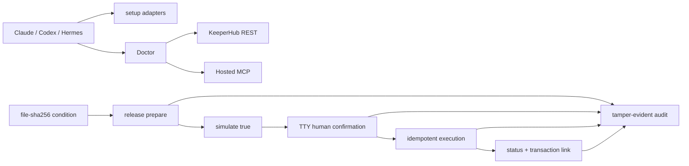

# KeeperHub Agent Starter + Doctor

A safety-first TypeScript starter for taking Claude Code, Codex, or Hermes from a fresh machine to an authenticated KeeperHub dry-run, with actionable diagnostics and a human-confirmed conditional bounty release path.

> Provenance disclosure: the private pre-event research and implementation baseline is preserved at tag `pre-event-rehearsal` (commit `c4d7d2a38e5dea9d607913a384cdf168aec78e9c`). Submission work is developed transparently on `hackathon/submission` after the conservative opening boundary. The earlier transaction remains onboarding evidence and is never represented as the final hackathon transaction.

## What it does

- Previews or applies the current official KeeperHub connection commands for Claude Code, Codex, and Hermes.
- Verifies an organization API key with a protected endpoint and calls the authenticated MCP `tools_documentation` tool.
- Checks Node/npm, dependencies, Agent configuration, `kh`, live chains, wallet address, balance/Gas, billing limits, and a real `simulate: true` transfer.
- Prepares a reproducible `file-sha256` bounty condition and binds it to an exact transfer intent and simulation.
- Requires a real TTY confirmation before any broadcast, persists one idempotency key with mode `0600`, safely retries only the same request, and produces a tamper-evident audit chain.
- Never accepts a private key and never prints `KH_API_KEY`, OAuth tokens, HMAC secrets, or the raw idempotency key.

## Requirements

- Node.js `>=22.12.0` and npm.
- A KeeperHub organization with an explicitly verified **EOA** organization wallet. Safe wallet semantics are intentionally blocked because the documented simulator uses the organization EOA as `from`.
- A KeeperHub organization API key with the official `kh_` prefix. Webhook keys with `wfb_` are not interchangeable.
- Ethereum Sepolia (`11155111`) for this Sepolia submission. Mainnet execution is disabled.

## Quick start

```bash
npm ci
npm run build
node dist/cli.js setup --agent all
```

The setup command is preview-only by default. Add `--apply` to invoke the official Agent CLIs:

```bash
node dist/cli.js setup --agent claude --apply
node dist/cli.js setup --agent codex --apply
node dist/cli.js setup --agent hermes --apply
```

Load the API key without placing it in shell history:

```bash
printf 'KeeperHub API key: ' >&2; IFS= read -rs KH_API_KEY; export KH_API_KEY; printf '\n' >&2
```

Alternatively, copy `.env.example` to the ignored `.env` file and restrict it to the current user:

```bash
cp .env.example .env
chmod 600 .env
```

Run the full diagnosis:

```bash
node dist/cli.js doctor --agent all
node dist/cli.js doctor --agent all --json
node dist/cli.js doctor --agent all --strict
```

Doctor never broadcasts. Its only transaction request contains the strict JSON boolean `"simulate": true` and self-transfers `0.000001` Sepolia ETH for preflight evidence.

## Agent onboarding paths

| Agent | Supported path | Authentication proof |
| --- | --- | --- |
| Claude Code | Hosted MCP at `https://app.keeperhub.com/mcp` | Complete `/mcp` OAuth; Doctor separately verifies an authenticated MCP tool with `KH_API_KEY` |
| Codex | `codex mcp add` + `codex mcp login` | Browser OAuth plus authenticated `tools_documentation` probe |
| Hermes | Official `KeeperHub/hermes-plugin` | Plugin reads `KH_API_KEY` from the environment; write tools remain disabled by default |

Configured is not the same as authenticated. Doctor reports Agent configuration, REST authentication, MCP reachability, and authenticated tool execution separately.

## Conditional bounty release

The demonstration condition is deliberately simple and reproducible: the approved deliverable must remain inside the workspace and its SHA-256 must match an operator-approved digest.

Prepare the exact intent and run a side-effect-free KeeperHub simulation:

```bash
shasum -a 256 demo/proof.txt
node dist/cli.js release prepare \
  --condition-file demo/proof.txt \
  --expected-sha256 <64-hex-digest> \
  --recipient <0x-recipient> \
  --amount 0.000001 \
  --chain-id 11155111 \
  --wallet-type eoa
```

`prepare` writes a ten-minute intent plan containing the public wallet address, condition digest, from/to, exact amount, Gas estimate, and simulation digests. It does not sign or broadcast.

After the event window opens, execution remains interactive:

```bash
node dist/cli.js release execute --wallet-type eoa
```

The command shows the complete transaction summary and accepts only `CONFIRM <intent-digest-prefix>` from a real TTY. There is no `--yes` or CI bypass. A cancelled, piped, expired, modified, Safe, non-Sepolia, or condition-mismatched request produces zero broadcast calls.

Safe recovery uses the private state containing the original idempotency key:

```bash
node dist/cli.js release retry
node dist/cli.js release status --poll
node dist/cli.js audit verify audit/release.jsonl
```

The public audit stores only the idempotency key's SHA-256 and chains every JSONL event with `previousHash` and `hash`.

## Architecture



The KeeperHub client is limited to endpoints verified in current documentation and actual onboarding: `/api/chains`, `/api/keys`, `/api/user/wallet/balances`, `/api/billing/subscription`, `/api/execute/transfer`, `/api/execute/{executionId}/status`, and `/mcp`.

## Failure contract

Every diagnostic identifies:

- `Step`: the operation that failed.
- `Cause`: likely causes supported by observed evidence.
- `Fix`: commands that can be copied without embedding a secret.
- `Evidence`: redacted status, versions, public addresses, chain data, or simulation fields.

Doctor JSON reports use `schemaVersion: 1` and `pass | warn | fail | skip`. Exit codes are `0` for required checks passing, `1` for diagnostic failure, `2` for usage errors, and `3` for internal or unsafe-response errors. `--strict` makes Doctor warnings blocking.

## Verification

```bash
npm run typecheck
npm test
npm run build
npm run test:secrets
npm run pack:check
npm run test:package
npm run verify
```

`npm run test:package` creates a fresh tarball, installs it beneath a temporary prefix with lifecycle scripts disabled, and checks the packaged CLI version and setup help. The secret-free CI workflow runs `npm ci` followed by `npm run verify` on Node.js 22.22.3.

The optional online integration suite performs only authenticated reads, an MCP documentation call, and a guarded `simulate: true` request:

```bash
npm run test:integration
```

Any integration transfer body without strict boolean `simulate: true` is rejected locally before it can reach KeeperHub. Broadcast behavior is tested only against local fixtures before the event.

## Verified onboarding evidence

- Organization wallet type: Turnkey EOA.
- Public wallet: `0x9b5f9ac9bd9e178962a50582f2b42b5523fcd042`.
- Chain: Ethereum Sepolia `11155111`.
- Faucet receipt: [Sepolia transaction](https://sepolia.etherscan.io/tx/0x339aeffad8f58c3cc57d86928590334f3eb6819947a3aac8c1b27adc722a53d5).
- KeeperHub onboarding execution: `04558fouwatcai4sz67b4`.
- Onboarding transaction: [verified Sepolia receipt](https://sepolia.etherscan.io/tx/0x35e132ed013188f0a6a60ebbe4b632c7cd843ccacfa8eb621d95aa70d8df6352).
- The same request and idempotency key replay returned the same execution ID; no second transaction was produced.

This transaction occurred before the event and is not represented as the final submission transaction.

## Reproducible onboarding blockers

| Priority | Blocker | Reproduction summary | Candidate fix |
| --- | --- | --- | --- |
| P0 | Device verification requires an undocumented claim request | Confirm page rejects the code until `GET /api/auth/device?user_code=...` occurs | Document or automate the claim step |
| P0 | Device login reports success with an unusable session | CLI prints success, then `kh auth status` fails and `get-session` returns `null` | Validate before persisting/reporting success |
| P0 | `kh doctor` reports authenticated for HTTP 200 `null` | Run Doctor with the unusable device token | Parse and validate the session body |
| P1 | Doctor protected checks omit Bearer auth | Use a valid `KH_API_KEY`; wallet and Spend Cap still say authentication required | Reuse the authenticated CLI HTTP client |
| P1 | Hermes direct OAuth connects with zero tools | Add hosted MCP with OAuth; logs show an async-lock exception | Recommend/fix the official plugin path |
| P1 | Wallet balance decoder expects string `chainId` | Live API returns a numeric `chainId` | Accept number or string |
| P1 | Wallet field mismatch | Doctor expects `address`; live response uses `walletAddress` | Parse the live field with compatibility fallback |
| P1 | macOS Gatekeeper rejects the release binary | Install with Homebrew and run the binary | Correct signing/notarization |
| P2 | Insufficient balance simulation is opaque | Simulate an amount above the wallet balance | Surface a clear balance diagnosis |
| P2 | `KH_CONFIG_DIR` is documented but ignored | Set it during login; files still go to the XDG directory | Implement or remove it |
| P2 | A public workflow probe can return 200 unauthenticated | Call `/api/workflows?limit=1` without a key | Do not use it as an API-key validity check |

The mergeable upstream Doctor patch, regression evidence, and PR draft live under `patches/`, `artifacts/upstream/`, and `docs/`. Nothing is submitted externally without a separate confirmation during the official judging window.

## Security boundaries

- No private key, seed phrase, wallet signature material, OAuth token, or HMAC secret is accepted or displayed.
- `KH_API_KEY` is read only from the process environment or a mode-`0600` ignored `.env`.
- Agent setup is preview-only unless `--apply` is explicit.
- Hermes write tools are not enabled by this starter.
- Simulation never counts as authorization to broadcast.
- Any change to chain, wallet, recipient, amount, condition, or simulation invalidates the prior digest and confirmation.
- Automatic retries are permitted only for the identical body and persisted idempotency key.
- Unknown execution state is treated as ambiguous; the program never creates a replacement key automatically.
- Mainnet and Safe execution are blocked in the release workflow.
- The time lock and TTY gate are CLI safety controls, not an operating-system
  sandbox. Exported library primitives accept test dependency injection, and
  `KeeperHubClient.executeTransfer` is a low-level broadcast primitive. Do not
  call it directly; the supported release path is the CLI workflow above.

## Official references

- [Agents Onchain Hackathon](https://dorahacks.io/hackathon/agents-onchain/detail)
- [KeeperHub Hackathon Quickstart](https://docs.keeperhub.com/quickstart)
- [KeeperHub MCP Server](https://docs.keeperhub.com/ai-tools/mcp-server)
- [KeeperHub Agentic Wallet](https://docs.keeperhub.com/ai-tools/agentic-wallet)
- [KeeperHub Direct Execution API](https://docs.keeperhub.com/api/direct-execution)
