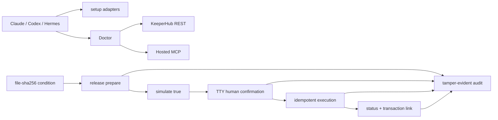

# KeeperHub Agent Starter + Doctor

A safety-first TypeScript starter for taking Claude Code, Codex, or Hermes from a fresh machine to an authenticated KeeperHub dry-run, with actionable diagnostics and a human-confirmed conditional bounty release path.

> Provenance disclosure: the private pre-event research and implementation baseline is preserved at tag `pre-event-rehearsal` (commit `c4d7d2a38e5dea9d607913a384cdf168aec78e9c`). Submission work is developed transparently on `hackathon/submission` after the conservative opening boundary. The earlier transaction remains onboarding evidence and is never represented as the final hackathon transaction.

The organizer later clarified that pre-event exploration/prototyping is allowed when the work is submitted and any upstream PR is opened during the event. The [dated organizer-clarification addendum](docs/submission/organizer-clarifications-2026-07-30.md) also resolves the deadline and confirms that Sepolia is accepted without a judging penalty.

## Hackathon submission

KeeperHub Agent Starter + Doctor turns a fragile, multi-Agent onboarding path into a short, diagnosable route from clean clone to authenticated read-only proof and a human-controlled conditional Sepolia release.

**Best Onboarding UX Improvement fit:** the project combines copyable setup adapters, a structured `Step / Cause / Fix / Evidence` Doctor, a reproducible blocker teardown, and a safety workflow toward a final transaction without hiding authentication, wallet, or retry state. It also targets the main prize through KeeperHub execution, strict simulation, exact human approval, idempotent recovery, KeeperHub completion validation, and a tamper-evident audit trail. Independent public explorer/RPC receipt verification remains a separate final-submission checkpoint.

**Final execution status: `recording-only-not-run`.** No final simulation may occur before the formal raw screen recording. During that one recording, exactly one strict `simulate: true` prepare may run, followed by the full summary, independent user authorization, execution, a separate real-TTY `CONFIRM` phrase, status, independent receipt verification, and final audit verification. See the [single-recording runbook](docs/submission/recording-runbook.md).

### Verified three-Agent support

| Agent | Official path | Verified result | Write boundary during evidence |
| --- | --- | --- | --- |
| Claude Code 2.1.207 | Hosted KeeperHub MCP with project-scoped setup and browser OAuth | Authenticated read-only `tools_documentation` invocation passed | Prompt-scoped to read-only; write tools were not structurally withheld |
| Codex CLI 0.144.3 | Hosted KeeperHub MCP with browser OAuth | Authenticated read-only `tools_documentation` invocation passed | Prompt-scoped to read-only; write tools were not structurally withheld |
| Hermes Agent 0.19.0 | Official `KeeperHub/hermes-plugin` with `KH_API_KEY` in the environment | Authenticated read-only `kh_tools_documentation` invocation passed | Structural: `KEEPERHUB_ENABLE_WRITES` was unset, so ten write/execute tools were not registered |

Full evidence and its limitations are in [the onboarding matrix](docs/submission/onboarding-evidence.md).

### Five-command clean-clone preview, then authentication and Doctor

```bash
git clone <repository-url> keeperhub-agent-starter-doctor
cd keeperhub-agent-starter-doctor
npm ci
npm run build
node dist/cli.js setup --agent all
```

`Repository URL: Pending — requires the separately authorized publication checkpoint.`

Those five commands end at a non-mutating setup preview. Review it, apply only the Agent path you need, complete its documented OAuth/API-key authentication, then run Doctor:

```bash
node dist/cli.js setup --agent <claude|codex|hermes> --apply
node dist/cli.js doctor --agent <claude|codex|hermes> --chain-id 11155111
```

A deterministic macOS missing/blank-`KH_API_KEY` check formats exactly as below. This is a sanitized local fixture, not live KeeperHub output:

```text
[FAIL] KH_API_KEY: Organization API key is missing or has the wrong prefix.
  Cause: Direct execution and authenticated MCP require an organization key with the kh_ prefix.
  Fix:
    cp .env.example .env && chmod 600 .env
    open https://app.keeperhub.com
  Evidence:
    present: false
    expectedPrefix: kh_
    valuePrinted: false
```

The copied `.env` is blank by design. Fill it locally, keep mode `0600`, and never display or commit the key.

Doctor verifies configuration, a protected REST read, authenticated MCP `tools_documentation`, Sepolia, public wallet/balance data, and a strict `simulate: true` self-transfer. It never broadcasts.

### Conditional release evidence path

The supported safety workflow is:

```text
file-sha256 condition
  → formal raw recording starts
  → exactly one strict KeeperHub simulation
  → full summary
  → independent user authorization
  → separate exact real-TTY confirmation
  → exclusive mode-0600 state
  → same-body/same-key retry or status polling
  → KeeperHub completion evidence validation
  → independent public explorer/RPC receipt verification
  → redacted hash-chain audit
```

The immutable submission condition is:

```bash
shasum -a 256 artifacts/submission/release-condition.json
# expected: 2cfae70f499548b2a1fd3a5b75c87ba597dacf82b63b4c9c066bc451b9042a46

```

The condition binds verification/onboarding evidence from source commit `afcf7028a7fe365760f7df5d76cf64b3e1f80923`. The organization wallet address is `0x9b5f9ac9bd9e178962a50582f2b42b5523fcd042`; its Turnkey EOA semantics and absence of a configured Safe are supported by official Turnkey documentation plus a recorded authenticated observation, not by Doctor alone. Raw authenticated UI evidence is unavailable in the public repository.

The only final namespace is `.keeperhub/final-release-plan.json`, `.keeperhub/final-release-state.json`, and `audit/final-release.jsonl`. Those paths must be absent before capture and may be created only in the order defined by the runbook. The default `.keeperhub/release-plan.json`, `.keeperhub/release-state.json`, and `audit/release.jsonl` paths are non-final rehearsal paths.

Any failed, ambiguous, interrupted, exposed, or expired take hard-aborts. There is no automatic second simulation; a new attempt requires a new formal recording and readiness decision.

- Final recipient: **Pending — not supplied.**
- Final signing/execution: **Pending — requires the separately authorized checkpoint.**
- Final transaction hash and explorer link: **Pending — no final transaction exists.**
- Public repository: **Pending — requires the separately authorized publication checkpoint.**
- Demo video: **Pending — raw final video unavailable; formal recording has not run.**
- DoraHacks submission and bounty application: **Pending — official timing and contribution eligibility are resolved; publication, submission, and bounty `Apply` each require their own immediate checkpoint.**

The earlier receipt `0x35e132ed013188f0a6a60ebbe4b632c7cd843ccacfa8eb621d95aa70d8df6352` is **pre-event onboarding evidence only**. It is not a final-transaction value.

### Judge map

- [Architecture](docs/submission/architecture.md) and [security model](docs/submission/security.md)
- [Verification evidence](artifacts/submission/verification.md) — frozen dated onboarding/Doctor/integration record
- [Current offline delivery gate](artifacts/submission/delivery-gate.md) — typecheck, unit/policy tests, build, package smoke, secret scan, links, and provenance
- [Organizer clarifications](docs/submission/organizer-clarifications-2026-07-30.md) — pre-event prototyping, PR timing, deadline, Sepolia, and judging guidance
- Local verification: `npm run verify`; focused secret check: `npm run test:secrets`
- [Ranked blockers and bounty copy](docs/submission/bounty-copy.md)
- [Current Quickstart auth patch](patches/keeperhub-cli-quickstart-auth.patch), [clean-apply evidence](artifacts/upstream/quickstart-patch-validation.txt), [focused tests](artifacts/upstream/quickstart-focused-tests.txt), and [prepared PR draft](docs/upstream-quickstart-pr-draft.md)
- [Historical Doctor patch evidence](artifacts/upstream/README.md) and [PR #75 resolution](docs/upstream-pr-draft.md)
- [Flexible one-take demo script](docs/submission/demo-script.md)
- [Single-recording runbook](docs/submission/recording-runbook.md) and [machine-readable policy](artifacts/submission/recording-policy.json)
- [Prepared DoraHacks form-field map](docs/submission/form-field-map.md)
- [DoraHacks copy](docs/submission/dorahacks-copy.md)

The current mergeable contribution corrects the KeeperHub CLI Quickstart device-login description against v0.13.1 commit `ef71237aecf9f448f65f808b859423bd99618149`: the user opens the printed URL, confirms the one-time code, and the resulting organization API key is stored in the printed `hosts.yml` path. It applies cleanly and passes documentation generation plus focused auth/config tests.

Separately, the historical Doctor patch/tests were independently recorded against KeeperHub CLI v0.10.0 on 2026-07-14. Equivalent official [KeeperHub/cli PR #75](https://github.com/KeeperHub/cli/pull/75) later merged at `72f68896aea6a792edd149d4ad42f90251eca332`. The no-duplicate-PR decision applies only to this historical Doctor fix; this project claims neither authorship nor influence.

## What it does

- Previews or applies the current official KeeperHub connection commands for Claude Code, Codex, and Hermes.
- Verifies an organization API key with a protected endpoint and calls the authenticated MCP `tools_documentation` tool.
- Checks Node/npm, dependencies, Agent configuration, `kh`, live chains, wallet address, balance/Gas, billing limits, and a real `simulate: true` transfer.
- Prepares a reproducible `file-sha256` bounty condition and binds it to an exact transfer intent and simulation.
- Requires a real TTY confirmation before any broadcast, persists one idempotency key with mode `0600`, safely retries only the same request, and produces a tamper-evident audit chain.
- Never accepts a private key and never prints `KH_API_KEY`, OAuth tokens, HMAC secrets, or the raw idempotency key.

## Requirements

- Node.js `>=22.12.0` and npm.
- A KeeperHub organization with an explicitly verified **EOA** organization wallet. Safe wallet semantics are intentionally blocked because the documented simulator uses the organization EOA as `from`.
- A KeeperHub organization API key with the official `kh_` prefix. Webhook keys with `wfb_` are not interchangeable.
- Ethereum Sepolia (`11155111`) for this Sepolia submission. Mainnet execution is disabled.

## Quick start

```bash
npm ci
npm run build
node dist/cli.js setup --agent all
```

The setup command is preview-only by default. Add `--apply` to invoke the official Agent CLIs:

```bash
node dist/cli.js setup --agent claude --apply
node dist/cli.js setup --agent codex --apply
node dist/cli.js setup --agent hermes --apply
```

Load the API key without placing it in shell history:

```bash
printf 'KeeperHub API key: ' >&2; IFS= read -rs KH_API_KEY; export KH_API_KEY; printf '\n' >&2
```

Alternatively, copy `.env.example` to the ignored `.env` file and restrict it to the current user:

```bash
cp .env.example .env
chmod 600 .env
```

Run the full diagnosis:

```bash
node dist/cli.js doctor --agent all
node dist/cli.js doctor --agent all --json
node dist/cli.js doctor --agent all --strict
```

Doctor never broadcasts. Its only transaction request contains the strict JSON boolean `"simulate": true` and self-transfers `0.000001` Sepolia ETH for preflight evidence.

## Agent onboarding paths

| Agent | Supported path | Authentication proof |
| --- | --- | --- |
| Claude Code | Hosted MCP at `https://app.keeperhub.com/mcp` | Complete `/mcp` OAuth; Doctor separately verifies an authenticated MCP tool with `KH_API_KEY` |
| Codex | `codex mcp add` + `codex mcp login` | Browser OAuth plus authenticated `tools_documentation` probe |
| Hermes | Official `KeeperHub/hermes-plugin` | Plugin reads `KH_API_KEY` from the environment; write tools remain disabled by default |

Configured is not the same as authenticated. Doctor reports Agent configuration, REST authentication, MCP reachability, and authenticated tool execution separately.

## Conditional bounty release

The demonstration condition is deliberately simple and reproducible: the approved deliverable must remain inside the workspace and its SHA-256 must match an operator-approved digest.

The following generic example uses the default **non-final rehearsal** namespace. It must not be used as final submission evidence:

```bash
shasum -a 256 demo/proof.txt
node dist/cli.js release prepare \
  --condition-file demo/proof.txt \
  --expected-sha256 <64-hex-digest> \
  --recipient <0x-recipient> \
  --amount 0.000001 \
  --chain-id 11155111 \
  --wallet-type eoa
```

`prepare` writes a ten-minute intent plan containing the public wallet address, condition digest, from/to, exact amount, Gas estimate, and simulation digests. It does not sign or broadcast.

Only after the compliance blockers are resolved and a separately authorized exact-summary checkpoint is granted does execution remain interactive:

```bash
node dist/cli.js release execute --wallet-type eoa
```

The command shows the complete transaction summary and accepts only the displayed `CONFIRM <plan-digest-prefix>` phrase from a real TTY. There is no `--yes` or CI bypass. A cancelled, piped, expired, modified, Safe, non-Sepolia, or condition-mismatched request produces zero broadcast calls.

Safe rehearsal recovery uses the default private state containing the original idempotency key:

```bash
node dist/cli.js release retry
node dist/cli.js release status --poll
node dist/cli.js audit verify audit/release.jsonl
```

Here `audit/release.jsonl` is non-final rehearsal evidence. The final public audit path is exactly `audit/final-release.jsonl`; it stores only the idempotency key's SHA-256 and chains every JSONL event with `previousHash` and `hash`.

## Architecture



The KeeperHub client is limited to endpoints verified in current documentation and actual onboarding: `/api/chains`, `/api/keys`, `/api/user/wallet/balances`, `/api/billing/subscription`, `/api/execute/transfer`, `/api/execute/{executionId}/status`, and `/mcp`.

## Failure contract

Every diagnostic identifies:

- `Step`: the operation that failed.
- `Cause`: likely causes supported by observed evidence.
- `Fix`: commands that can be copied without embedding a secret.
- `Evidence`: redacted status, versions, public addresses, chain data, or simulation fields.

Doctor JSON reports use `schemaVersion: 1` and `pass | warn | fail | skip`. Exit codes are `0` for required checks passing, `1` for diagnostic failure, `2` for usage errors, and `3` for internal or unsafe-response errors. `--strict` makes Doctor warnings blocking.

## Verification

```bash
npm run typecheck
npm test
npm run build
npm run test:secrets
npm run pack:check
npm run test:package
npm run verify
```

`npm run test:package` creates a fresh tarball, installs it beneath a temporary prefix with lifecycle scripts disabled, and checks the packaged CLI version and setup help. The secret-free CI workflow runs `npm ci` followed by `npm run verify` on Node.js 22.22.3.

The optional online integration suite performs only authenticated reads, an MCP documentation call, and a guarded `simulate: true` request:

```bash
npm run test:integration
```

Any integration transfer body without strict boolean `simulate: true` is rejected locally before it can reach KeeperHub. Broadcast behavior is tested only against local fixtures before the event.

## Pre-event onboarding transaction evidence — not final

- Organization wallet type: Turnkey EOA.
- Public wallet: `0x9b5f9ac9bd9e178962a50582f2b42b5523fcd042`.
- Chain: Ethereum Sepolia `11155111`.
- Faucet receipt: [Sepolia transaction](https://sepolia.etherscan.io/tx/0x339aeffad8f58c3cc57d86928590334f3eb6819947a3aac8c1b27adc722a53d5).
- KeeperHub onboarding execution: `04558fouwatcai4sz67b4`.
- Onboarding transaction: [verified Sepolia receipt](https://sepolia.etherscan.io/tx/0x35e132ed013188f0a6a60ebbe4b632c7cd843ccacfa8eb621d95aa70d8df6352).
- The same request and idempotency key replay returned the same execution ID; no second transaction was produced.

This transaction occurred before the event and is not represented as the final submission transaction.

## Reproducible onboarding blockers

| Priority | Blocker | Reproduction summary | Candidate fix |
| --- | --- | --- | --- |
| P0 | Device verification requires an undocumented claim request | Confirm page rejects the code until `GET /api/auth/device?user_code=...` occurs | Document or automate the claim step |
| P0 | Device login reports success with an unusable session | CLI prints success, then `kh auth status` fails and `get-session` returns `null` | Validate before persisting/reporting success |
| P0 | `kh doctor` reports authenticated for HTTP 200 `null` | Independently reproduced on 2026-07-14; official equivalent fix later merged in [PR #75](https://github.com/KeeperHub/cli/pull/75) | Resolved upstream with a protected credential probe |
| P1 | Doctor protected checks omit Bearer auth | Independently reproduced on 2026-07-14; [PR #75](https://github.com/KeeperHub/cli/pull/75) now resolves/sends `Authorization` | Resolved upstream with authenticated client/probe handling |
| P1 | Hermes direct OAuth connects with zero tools | Add hosted MCP with OAuth; logs show an async-lock exception | Recommend/fix the official plugin path |
| P1 | Wallet balance decoder expects string `chainId` | Recorded API response used a numeric `chainId` | Accept number or string |
| P1 | Wallet field mismatch | Doctor expects `address`; recorded response used `walletAddress` | Parse the recorded field with compatibility fallback |
| P1 | macOS Gatekeeper rejects the release binary | Install with Homebrew and run the binary | Correct signing/notarization |
| P2 | Insufficient balance simulation is opaque | Simulate an amount above the wallet balance | Surface a clear balance diagnosis |
| P2 | `KH_CONFIG_DIR` is documented but ignored | Set it during login; files still go to the XDG directory | Implement or remove it |
| P2 | A public workflow probe can return 200 unauthenticated | Independently reproduced on 2026-07-14; [PR #75](https://github.com/KeeperHub/cli/pull/75) uses protected `/api/projects` instead | Resolved upstream with the shared protected credential probe |

The Doctor issue was independently reproduced and patched locally on 2026-07-14 against v0.10.0. An equivalent official fix later merged as [KeeperHub/cli PR #75](https://github.com/KeeperHub/cli/pull/75) (`72f68896aea6a792edd149d4ad42f90251eca332`), so no duplicate Doctor PR was opened. The historical v0.10.0 patch and tests remain preserved evidence under `patches/` and `artifacts/upstream/`; see `docs/upstream-pr-draft.md` for the upstream-resolution record. This historical decision does not block the separate current [Quickstart documentation patch](patches/keeperhub-cli-quickstart-auth.patch).

## Security boundaries

- No private key, seed phrase, wallet signature material, OAuth token, or HMAC secret is accepted or displayed.
- `KH_API_KEY` is read from the process environment, which may optionally be populated by the ignored mode-`0600` `.env` loader; it is never accepted as a CLI argument or printed.
- Agent setup is preview-only unless `--apply` is explicit.
- Hermes write tools are not enabled by this starter.
- Simulation never counts as authorization to broadcast.
- Any change to chain, wallet, recipient, amount, condition, or simulation invalidates the prior digest and confirmation.
- Automatic retries are permitted only for the identical body and persisted idempotency key.
- Unknown execution state is treated as ambiguous; the program never creates a replacement key automatically.
- Mainnet and Safe execution are blocked in the release workflow.
- The time lock and TTY gate are CLI safety controls, not an operating-system
  sandbox. Exported library primitives accept test dependency injection, and
  `KeeperHubClient.executeTransfer` is a low-level broadcast primitive. Do not
  call it directly; the supported release path is the CLI workflow above.

## Official references

- [Agents Onchain Hackathon](https://dorahacks.io/hackathon/agents-onchain/detail)
- [KeeperHub Hackathon Quickstart](https://docs.keeperhub.com/quickstart)
- [KeeperHub MCP Server](https://docs.keeperhub.com/ai-tools/mcp-server)
- [KeeperHub Agentic Wallet](https://docs.keeperhub.com/ai-tools/agentic-wallet)
- [KeeperHub Direct Execution API](https://docs.keeperhub.com/api/direct-execution)
