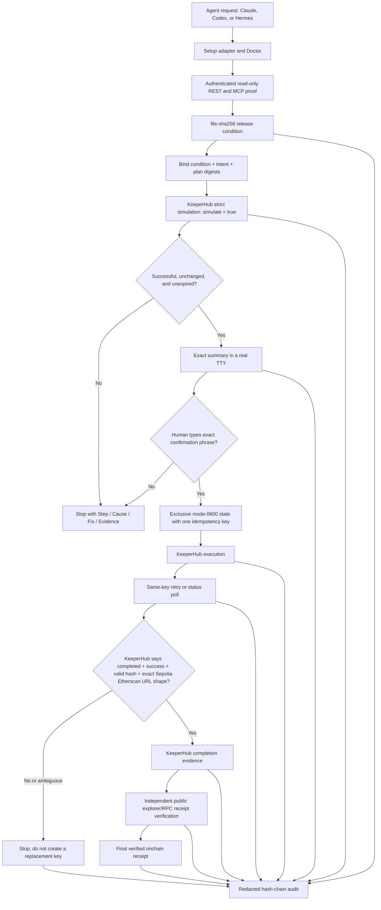

# Architecture

KeeperHub Agent Starter + Doctor has two deliberately separate lanes: onboarding/diagnosis is read-only except for a strict simulation, while release is a stateful safety protocol around KeeperHub execution. The public CLI workflow—not the exported low-level client—is the supported interface for a real transfer.

## Components and boundaries

| Component | Responsibility | Boundary |
| --- | --- | --- |
| Setup adapters | Render or explicitly apply the official Claude, Codex, and Hermes setup commands | Preview-only by default; no credential storage; Agent configuration is not treated as authentication proof |
| Doctor orchestrator | Run runtime, dependency, Agent, REST, MCP, chain, wallet, Gas, billing, and simulation checks | Emits `pass / warn / fail / skip` with `Step / Cause / Fix / Evidence`; never signs or broadcasts |
| Validated KeeperHub client | Call the documented REST surfaces and validate responses | `KH_API_KEY` comes from the process environment, optionally populated by the ignored mode-0600 `.env` loader, and is never a CLI argument/output; simulation hard-codes boolean `true`; broadcast is a low-level primitive and is unsupported outside the release service |
| MCP probe | List tools and invoke authenticated `tools_documentation` | Read-only proof; redacts failures; does not equate reachability or configuration with authentication |
| Release condition | Bind an approved workspace file to its exact SHA-256 | Path must remain inside the workspace; a mismatch stops before simulation or execution |
| Intent and plan | Bind condition, chain, wallet type/address, recipient, amount, simulation, and digests | Sepolia `11155111` and EOA only; plan expires after ten minutes; any bound-field change invalidates it |
| TTY confirmation | Show the exact transfer and require `CONFIRM <intent-prefix>` | stdin and stdout must both be real TTYs; there is no `--yes`, pipe, or CI bypass |
| Private execution state | Persist one idempotency key and the digest-bound/checksummed state envelope | Created exclusively before POST; mode `0600`; existing state is never overwritten |
| Idempotent executor | Revalidate condition, plan, wallet, and exact request, then submit | Initial attempt plus at most three safe retries; only the same body and persisted key may be reused |
| Status poller | Query `/api/execute/{executionId}/status` using the returned execution ID | Honors polling hints; a completed result is accepted only with success, a valid hash, and a matching Sepolia Etherscan URL |
| Hash-chain audit | Record condition, simulation, confirmation, submit/retry, status, KeeperHub completion evidence, and ambiguity events | Secrets and raw idempotency keys are redacted; every JSONL row binds `previousHash`; verification refuses a broken chain |

## End-to-end flow

## Data and trust flow

The user supplies an organization `KH_API_KEY` through the process environment, optionally populated by the ignored mode-0600 `.env` loader, and later supplies a distinct recipient through a CLI argument. The API key itself is never a CLI argument or output. KeeperHub supplies chain, public organization-wallet, simulation, execution, and status data. The release service normalizes and binds those values before approval. The API key never enters a plan or audit record; the private state contains the idempotency key and therefore is not public evidence.

The CLI's completion check is intentionally narrower than onchain receipt verification: it requires KeeperHub status `completed`, `result.success: true`, a valid 32-byte hash, and an exact HTTPS Sepolia Etherscan transaction-URL shape. It does not fetch or independently verify the public chain receipt. A later explorer/RPC receipt check is required before the final submission can claim verified onchain execution.

The immutable condition file currently has SHA-256 `2cfae70f499548b2a1fd3a5b75c87ba597dacf82b63b4c9c066bc451b9042a46` and binds evidence at source commit `afcf7028a7fe365760f7df5d76cf64b3e1f80923`. It specifies Sepolia `11155111` and `0.000001 ETH`. It does not supply a recipient or authorize execution.

Wallet conclusions use two independent sources: official KeeperHub Turnkey documentation establishes organization-wallet EOA semantics; authenticated UI proof establishes the exact public wallet `0x9b5f9ac9bd9e178962a50582f2b42b5523fcd042`, zero configured Safe cards/Sender switches, and EVM “No cap set.” Doctor alone intentionally reports wallet type as unknown and execution disallowed.

## Current evidence state

- Three authenticated read-only Agent invocations passed: Claude, Codex, and Hermes.
- The frozen verification record truthfully preserves its 8-file / 62-test gate.
- The current local gate is 9 test files / 65 tests, including 3 isolated Git-process tests for condition generation.
- Final recipient, signing, execution, receipt, audit, public repository, video, and submission URLs: **Pending — require later separately authorized checkpoints.**
- The pre-event onboarding receipt is evidence of onboarding and idempotent replay only; it is not final submission execution evidence.
